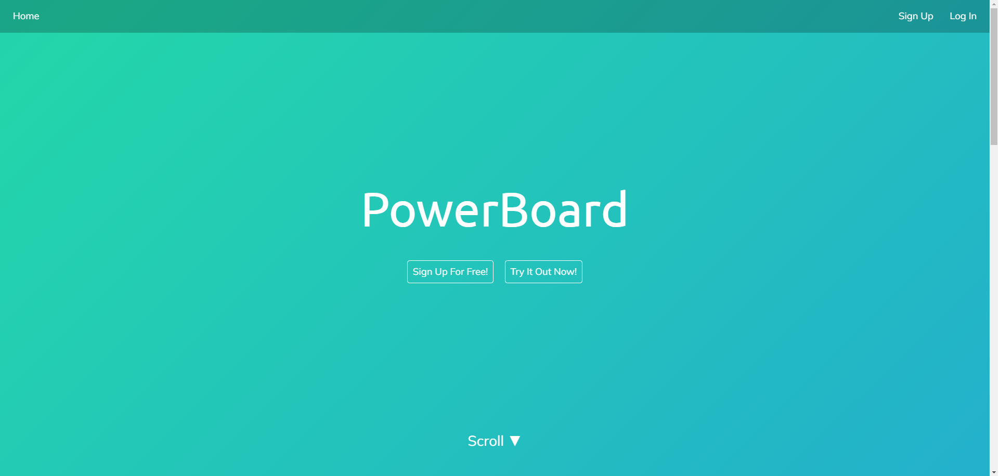
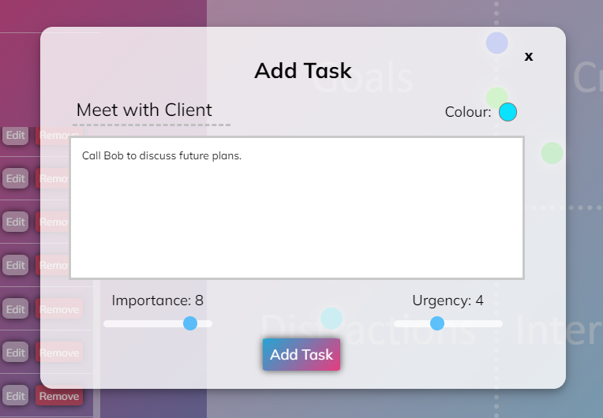
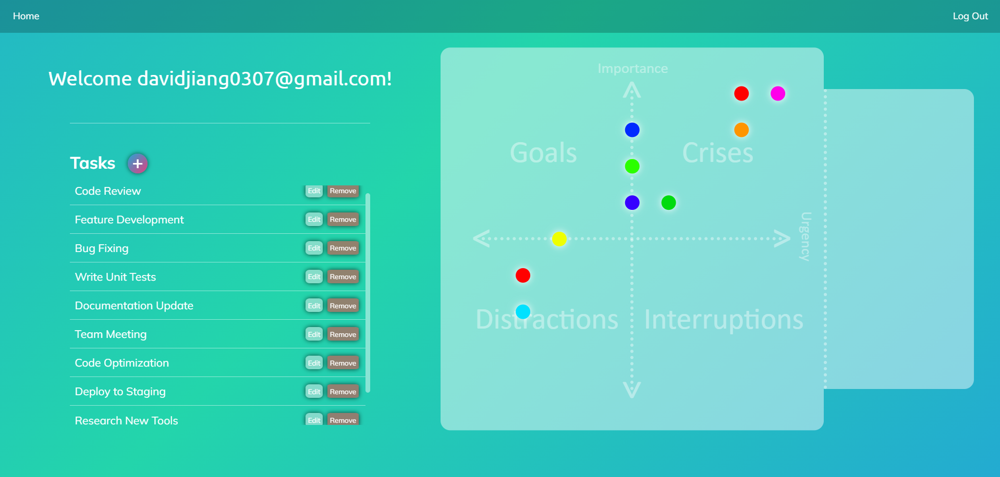

# PowerBoard: Task Planner

Welcome to the GitHub page of PowerBoard! This application helps you organize your tasks using the Eisenhower matrix, allowing you to prioritize and manage your time effectively.

## Features

- **Task Management**: Add, edit, and remove tasks.
- **Eisenhower Matrix Visualization**: Visualize tasks on a matrix based on their importance and urgency.
- **Guest Access**: Try the app as a guest without signing up.
- **User Accounts**: Create an account to save and manage your tasks.
- **Customizable Tasks**: Provide a brief description and choose the color for each task point on the graph.

## Screenshots

### Home Screen

### Add Task

### Task Visualization

## Usage

1. Open the app in your browser: [https://powerboard-f656e.web.app](https://powerboard-f656e.web.app)

2. Sign up for an account or use the guest access to try out the app.

3. Add tasks by providing a description, importance, and urgency value.

4. Visualize your tasks on the Eisenhower matrix.

## Contact
Built using SvelteKit and Google Firebase. Created by David Jiang.
For any inquiries or support, please contact me at [davidjiang0307@gmail.com](davidjiang0307@gmail.com) or visit my [website](https://dvdoso.github.io/portfolio-website/).
